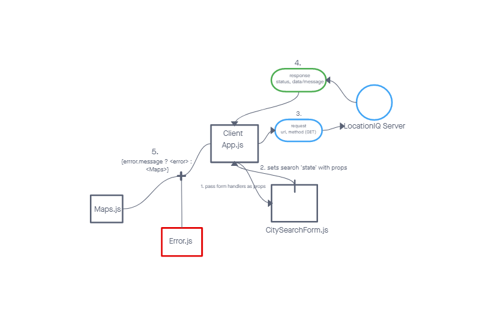
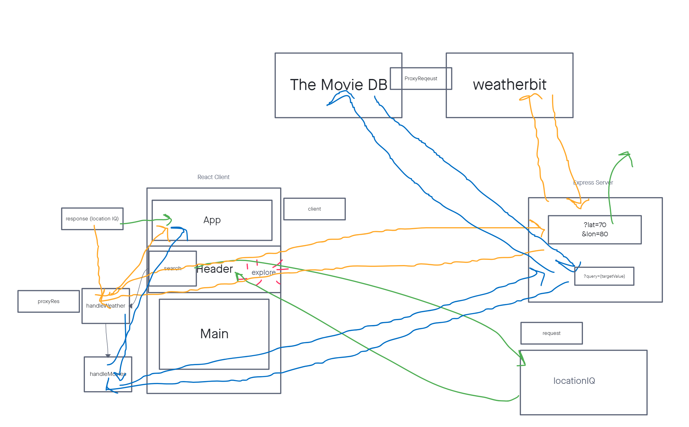
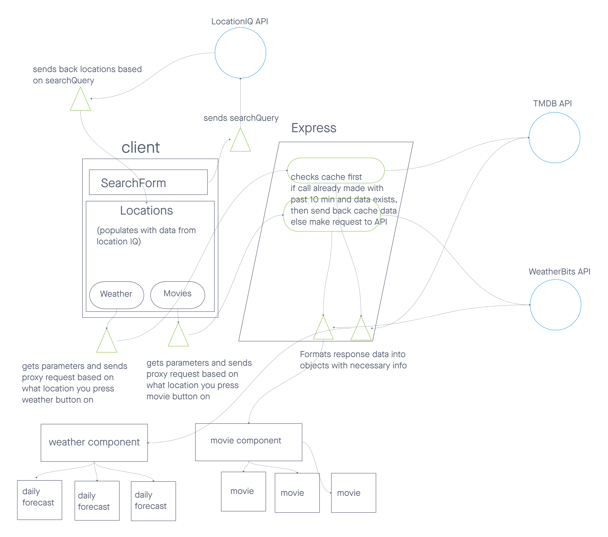

# City Explorer

**Author**: James Ian Ragasa Solima
**Version**: 1.0.0 (increment the patch/fix version number if you make more commits past your first submission)

## Overview

[Deployed Site](https://james-city-explorer.netlify.app/)

This city explorer application is for searching up a city and receiving all the cities in the world that match that search along with their longitude, lattitude, state, country, zip code, image of map location and more!

<!-- Provide a high level overview of what this application is and why you are building it, beyond the fact that it's an assignment for this class. (i.e. What's your problem domain?) -->

## Getting Started

Required packages:
- npm install react
- npm install react-bootstrap bootstrap
- npm install nodemon

Required APIs:
 
[LocationIQ](https://locationiq.com/)
 
<!-- What are the steps that a user must take in order to build this app on their own machine and get it running? -->

## Architecture
>ver 1.0.0 
>
>ver 1.0.1 
> </a>
>ver 1.02 
>

<!-- Provide a detailed description of the application design. What technologies (languages, libraries, etc) you're using, and any other relevant design information. -->

## Change Log

02-20-2023 Start: 1355, Finish: 1440, Time: 45min - Set up React environment & API Keys

02-20-2023 Start: 1450, Finish: 1636, Time: 1 hour 46 min - Adds search functionality, to render information of location

02-20-2023 Start: 1650, Finish: 1710, Time: 20min - Adds static maps to render with location result from search

02-20-2023 Start: 1730, Finish: 1755, Time: 25 min - Adds Error rendering if search or API call is bad.

02-21-2023 Start: 1910 , Finish: 2210, Time: 3 hours - Connects city-explorer to city-explorer-api, adds Weather component to display when user clicks on location card

02-22-2023 Start 1620 - Uses Weatherbits API To retrieve and display weather data Finish: 1750, Time: 1 hour 30 min

02-22-2023 Start 1910 - Created Movie component to display movie data that includes the city name of the location clicked. Finish: 2200, Time: 1 hour 30 min

02-22-2023 Start 2240 - Deployed to netlify, can navigate without running local server, now that server is deployed to the cloud Finish: 2300, Time: 20 min

<!-- Use this area to document the iterative changes made to your application as each feature is successfully implemented. Use time stamps. Here's an example:

01-01-2001 4:59pm - Application now has a fully-functional express server, with a GET route for the location resource. -->

## Credit and Collaborations

>[Sheldon Pierce for Helping with the WRRC Diagram](https://github.com/Sheldon-Pierce)
>

<!-- Give credit (and a link) to other people or resources that helped you build this application. -->

